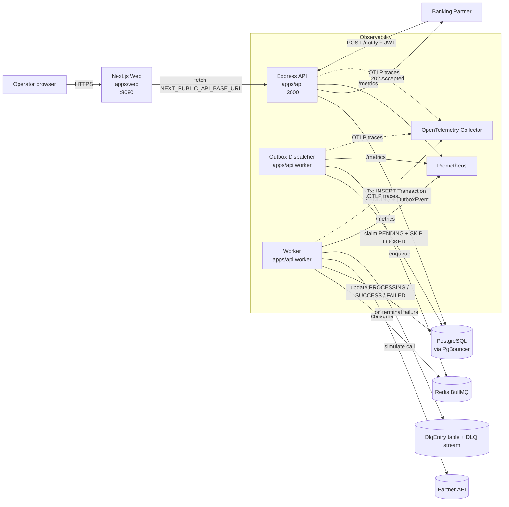

# banking-devops-platform

A full-stack production-style banking transaction notification platform with an operations dashboard, built as a real-world DevOps/SRE portfolio project.

It demonstrates the full delivery loop: backend API design, async job processing with retries + DLQ, outbox pattern, observability (logs + metrics + tracing + probes), containerization, Kubernetes deployment with canary, GitOps, CI/CD with k6 smoke, and an operator-facing **Next.js dashboard** that turns the platform into a real demo.

> **TL;DR.** The API receives a partner notification, persists it together with an outbox event in a single Prisma transaction, and immediately returns 202. A separate **outbox dispatcher** drains pending events into BullMQ. A separate **worker** processes jobs, simulates a partner API call, retries with exponential backoff, and on terminal failure writes a **DLQ entry**. The **Next.js dashboard** at `:8080` shows live state across all of it. The whole stack runs locally with `docker compose up --build`.

---

## Table of contents

- [Architecture](#architecture)
- [Monorepo layout](#monorepo-layout)
- [Tech stack](#tech-stack)
- [Local development](#local-development)
- [Docker Compose](#docker-compose)
- [Database migrations](#database-migrations)
- [API examples (curl)](#api-examples-curl)
- [Frontend dashboard pages](#frontend-dashboard-pages)
- [Worker, outbox, DLQ](#worker-outbox-dlq)
- [JWT auth](#jwt-auth)
- [OpenTelemetry tracing](#opentelemetry-tracing)
- [Kubernetes deployment](#kubernetes-deployment)
- [Helm chart](#helm-chart)
- [GitOps with ArgoCD](#gitops-with-argocd)
- [Canary rollouts](#canary-rollouts)
- [Load testing with k6](#load-testing-with-k6)
- [Grafana dashboard](#grafana-dashboard)
- [Metrics](#metrics)
- [Logging](#logging)
- [CI/CD](#cicd)
- [Troubleshooting](#troubleshooting)
- [What this project demonstrates](#what-this-project-demonstrates)
- [Documentation map](#documentation-map)

---

## Architecture



The web tier is a thin client. It only renders data — it does not embed business logic. All decisions live in the API and worker.

---

## Monorepo layout

```text
.
├── apps/
│   ├── api/                       Backend: Express + worker + outbox dispatcher
│   │   ├── src/                   config, controllers, routes, services, repositories,
│   │   │                          jobs, workers, middlewares, utils, metrics, types, observability
│   │   ├── prisma/schema.prisma   Transaction, JobLog, OutboxEvent, DlqEntry
│   │   ├── package.json
│   │   ├── tsconfig.json
│   │   └── Dockerfile
│   │
│   └── web/                       Frontend: Next.js operations dashboard
│       ├── app/                   App Router pages (5 + /api/health)
│       ├── components/            Nav, StatusPill, States
│       ├── lib/                   api.ts (fetch client), format.ts
│       ├── types/api.ts
│       ├── public/
│       ├── package.json
│       ├── tsconfig.json
│       ├── next.config.js
│       └── Dockerfile
│
├── argocd/application.yaml        ArgoCD Application + AppProject
├── docs/                          PRD, architecture, runbook, incident response, deployment
├── helm/banking-devops-platform/  Helm chart + per-env values
├── k8s/                           Plain manifests (alt to Helm)
│   ├── 00-namespace.yaml
│   ├── 01-configmap.yaml
│   ├── 02-secret.example.yaml
│   ├── 10-postgres.yaml, 15-pgbouncer.yaml, 20-redis.yaml
│   ├── 30-api-deployment.yaml, 31-api-service.yaml, 32-api-ingress.yaml
│   ├── 35-api-rollout.yaml      Argo Rollouts canary
│   ├── 40-worker-deployment.yaml, 41-outbox-deployment.yaml
│   ├── 50-web-deployment.yaml, 51-web-service.yaml, 52-web-ingress.yaml
│   └── 60-hpa.yaml              HPAs for API + Web
├── loadtest/k6/smoke.js           k6 smoke
├── observability/dashboards/      Grafana JSON
├── .github/workflows/ci.yml       Monorepo CI
├── docker-compose.yml             api + worker + outbox + web + postgres + pgbouncer + redis
├── package.json                   Workspace root with `install:all`, `dev:api`, `dev:web`, etc.
└── README.md
```

---

## Tech stack

- **Backend:** Node.js 20, Express 4, TypeScript 5, Helmet, CORS, express-rate-limit, Zod, jsonwebtoken
- **DB:** PostgreSQL 16 + Prisma 5, optional PgBouncer
- **Queue:** Redis 7 + BullMQ 5 (main + DLQ)
- **Outbox:** Postgres-backed `OutboxEvent` table with `SELECT FOR UPDATE SKIP LOCKED`
- **Frontend:** Next.js 14 (App Router), React 18, TypeScript, plain CSS
- **Observability:** pino, prom-client, OpenTelemetry SDK + auto-instrumentations
- **Container:** multi-stage Dockerfiles, non-root user
- **Orchestration:** Kubernetes manifests + Helm chart + Argo Rollouts canary
- **GitOps:** ArgoCD Application + AppProject
- **CI/CD:** GitHub Actions, Trivy, kubeconform, Helm lint/template, k6

---

## Why This Tech Stack use in this project?

Each component was selected to demonstrate **Production-Grade reliability** and **Operational Excellence**:

- **The Outbox Pattern (Postgres + BullMQ):** We use a Postgres-backed outbox to ensure that we never lose a transaction notification, even if Redis or the network fails during a request.
- **GitOps (ArgoCD):** By using ArgoCD, we eliminate manual `kubectl apply` commands, ensuring the cluster always matches the state defined in Git.
- **Advanced Observability (OTel + Prom):** The system isn't just "running"; it's fully transparent. Every request can be traced from the API to the background worker.
- **Canary Deployments (Argo Rollouts):** We demonstrate high-availability by using Canary releases instead of basic Rolling Updates, reducing the blast radius of new code.
- **Sealed Secrets:** We solve the "secrets in Git" problem by using cluster-side decryption, allowing us to keep the entire system's state in the repository safely.

---

## Local development

```bash
# 1. Install root + workspace dependencies
npm install
npm run install:all

# 2. Copy env and adjust
cp .env.example .env

# 3. Start dependencies
docker compose up -d postgres redis

# 4. Generate Prisma client + migrate (runs in apps/api)
npm run prisma:generate
npm run prisma:migrate

# 5. Run each process in its own terminal
npm run dev:api          # API on http://localhost:3000
npm run worker           # Worker, /health + /metrics on :3001
npm run outbox           # Outbox dispatcher, /health + /metrics on :3002
npm run dev:web          # Dashboard on http://localhost:8080
```

Open the dashboard: **<http://localhost:8080>**.

---

## Docker Compose

The full stack — API + worker + outbox + web + postgres + pgbouncer + redis — comes up with one command:

```bash
docker compose up --build
```

Endpoints:

- API:        <http://localhost:3000> (health, ready, metrics, /api/v1/...)
- Web:        <http://localhost:8080>
- Postgres:   `localhost:5432`
- PgBouncer:  `localhost:6432`
- Redis:      `localhost:6379`
- Worker metrics:  <http://localhost:3001/metrics>
- Outbox metrics:  <http://localhost:3002/metrics>

```bash
docker compose logs -f api
docker compose logs -f worker
docker compose logs -f outbox
docker compose logs -f web

docker compose down              # keep volumes
docker compose down -v           # also delete data
```

Override the public API URL the dashboard talks to:

```bash
NEXT_PUBLIC_API_BASE_URL=https://api.banking.example.com docker compose up --build web
```

---

## Database migrations

```bash
# All commands proxy to apps/api
npm run prisma:generate
npm run prisma:migrate           # production: prisma migrate deploy
npm run prisma:migrate:dev       # dev: create new migration
```

Schema models: `Transaction`, `JobLog`, `OutboxEvent`, `DlqEntry` (see [apps/api/prisma/schema.prisma](apps/api/prisma/schema.prisma)).

---

## API examples (curl)

```bash
# Submit a notification
curl -i -X POST http://localhost:3000/api/v1/transactions/notify \
  -H "Content-Type: application/json" \
  -d '{"transaction_id":"TXN-2026-0001","account_id":"ACC-001","amount":100.50,"currency":"USD","status":"SUCCESS","description":"Payment received"}'

# List transactions (paginated, filter, search)
curl -s 'http://localhost:3000/api/v1/transactions?limit=20&offset=0&processing_status=SUCCESS&q=TXN-' | jq

# Detail (with embedded JobLogs)
curl -s http://localhost:3000/api/v1/transactions/TXN-2026-0001 | jq

# Jobs summary (used by dashboard cards)
curl -s http://localhost:3000/api/v1/jobs/summary | jq

# System status (api/db/redis/queue)
curl -s http://localhost:3000/api/v1/system/status | jq

# Health / readiness / metrics
curl -s http://localhost:3000/health
curl -s http://localhost:3000/ready
curl -s http://localhost:3000/metrics | head -40

# Admin / DLQ
ADMIN=change-me-admin-key
curl -s -H "x-admin-api-key: $ADMIN" "http://localhost:3000/api/v1/admin/dlq?status=OPEN"
curl -i -X POST -H "x-admin-api-key: $ADMIN" "http://localhost:3000/api/v1/admin/dlq/TXN-FAIL/requeue"
```

---

## Frontend dashboard pages

URL: **<http://localhost:8080>**.

| Path                                    | Purpose                                                                    |
| --------------------------------------- | -------------------------------------------------------------------------- |
| `/`                                     | Dashboard — totals + dependency health + queue (auto-refresh every 10s).   |
| `/transactions`                         | List with search, status filter, pagination, refresh.                      |
| `/transactions/[transaction_id]`        | Detail with partner response, error message, JobLog timeline.              |
| `/notify`                               | Form that calls `POST /api/v1/transactions/notify`; redirects to detail.   |
| `/system`                               | Same data as the dashboard but expanded; deep links to `/health` etc.      |

Frontend rules in code:

- Loading / error / empty states on every page.
- The web app is a thin client; no business logic.
- Backend internal errors are not surfaced verbatim — the user sees a clean message.
- All backend access goes through `apps/web/lib/api.ts`, which reads `NEXT_PUBLIC_API_BASE_URL`.

---

## Worker, outbox, DLQ

Three independent processes, each from the same backend image:

| Process           | Command                                   | Port           |
| ----------------- | ----------------------------------------- | -------------- |
| API               | `node dist/server.js`                     | 3000           |
| Worker            | `node dist/workers/transaction.worker.js` | 3001 (metrics) |
| Outbox dispatcher | `node dist/workers/outbox.dispatcher.js`  | 3002 (metrics) |

The outbox dispatcher uses `SELECT … FOR UPDATE SKIP LOCKED` so multiple replicas are safe in parallel. DLQ semantics:

- Worker writes `DlqEntry` (status `OPEN`) and pushes to a `transaction-notification-dlq` BullMQ stream.
- `dlqService.requeue` flips the transaction back to `PENDING`, enqueues fresh, marks the DLQ entry `REQUEUED`.
- `dlqService.dismiss` closes a DLQ entry without retry.

---

## JWT auth

Off by default for friction-free local dev. Enable in production:

```env
JWT_AUTH_ENABLED=true
PARTNER_JWT_SECRET=<strong-shared-secret>
PARTNER_JWT_ISSUER=banking-partner
PARTNER_JWT_AUDIENCE=banking-devops-platform
```

Admin endpoints use a separate static API key via `x-admin-api-key`.

---

## OpenTelemetry tracing

```env
OTEL_ENABLED=true
OTEL_SERVICE_NAME=banking-api
OTEL_EXPORTER_OTLP_ENDPOINT=http://otel-collector:4318
```

Auto-instrumentations cover HTTP, Express, `pg`, `ioredis`. Quick local visualization:

```bash
docker run -d --name jaeger -p 16686:16686 -p 4318:4318 jaegertracing/all-in-one:latest
OTEL_ENABLED=true OTEL_EXPORTER_OTLP_ENDPOINT=http://localhost:4318 docker compose up
# open http://localhost:16686
```

---

## Kubernetes deployment

```bash
# Build images & load into a local cluster (kind shown)
docker build -t banking-devops-platform-api:latest -f apps/api/Dockerfile .
docker build -t banking-devops-platform-web:latest \
  --build-arg NEXT_PUBLIC_API_BASE_URL=http://localhost:3000 \
  -f apps/web/Dockerfile .
kind load docker-image banking-devops-platform-api:latest banking-devops-platform-web:latest

# Apply
cp k8s/02-secret.example.yaml k8s/02-secret.yaml    # edit values first
kubectl apply -f k8s/

kubectl get pods -n banking-devops-platform -w
kubectl -n banking-devops-platform port-forward svc/banking-web 8080:80
kubectl -n banking-devops-platform port-forward svc/banking-api 3000:80   # in another terminal
```

`k8s/` resources: `00-namespace`, `01-configmap`, `02-secret.example`, `10-postgres`, `15-pgbouncer`, `20-redis`, `30/31/32-api-*`, `35-api-rollout` (canary), `40-worker-deployment`, `41-outbox-deployment`, `50/51/52-web-*`, `60-hpa` (api + web).

---

## Helm chart

See [helm/banking-devops-platform](helm/banking-devops-platform). The chart covers API, Worker, and Outbox today; Web manifests are deployed via the `k8s/50/51/52-*.yaml` files for now (or wire them into the chart as a follow-up).

```bash
helm install banking helm/banking-devops-platform \
  -n banking-devops-platform --create-namespace
```

---

## GitOps with ArgoCD

```bash
kubectl apply -f argocd/application.yaml   # after editing repoURL
argocd app get banking-devops-platform
```

Auto-sync, auto-prune, self-heal are enabled.

---

## Canary rollouts

`k8s/35-api-rollout.yaml` defines an Argo Rollouts `Rollout` with steps `20→40→60→80→100%` and a Prometheus-driven `AnalysisTemplate` gating each step on success rate. Requires the Argo Rollouts controller.

---

## Load testing with k6

```bash
npm run loadtest                            # default: 5 VUs, 30s
BASE_URL=http://localhost:3000 VUS=20 DURATION=2m k6 run loadtest/k6/smoke.js
```

CI runs this against an ephemeral compose stack on every push.

---

## Grafana dashboard

Import [observability/dashboards/banking-overview.json](observability/dashboards/banking-overview.json) (Prometheus datasource).

---

## Metrics

```text
http_requests_total
http_request_duration_seconds
transactions_created_total
transaction_jobs_success_total
transaction_jobs_failed_total
transaction_job_processing_duration_seconds
database_health_status
redis_health_status

# v1.1+
outbox_events_dispatched_total{event_type=...}
outbox_events_dispatch_failed_total{event_type=...}
outbox_pending_events
outbox_dispatch_lag_seconds
dlq_entries_total
dlq_requeued_total
```

Plus default Node.js process metrics.

---

## Logging

Structured JSON via `pino`. Each line carries `request_id`, `transaction_id`, `job_id`, `attempt`, `processing_status`, `duration_ms`, and `error_message` as appropriate. Sensitive fields are redacted by `pino` config in [apps/api/src/utils/logger.ts](apps/api/src/utils/logger.ts).

---

## CI/CD

`.github/workflows/ci.yml` jobs:

1. **build-and-test** — install both workspaces, lint API + Web, build API (`tsc`) and Web (`next build`), tests
2. **docker-build-scan** — build API image + Web image (cached), Trivy scans
3. **validate-k8s** — `kubeconform` over `k8s/` (skipping example secret + Argo CRDs) + `helm lint` + `helm template` for default / dev / prod
4. **k6-smoke** — bring up the full compose stack, wait for API `/ready` and Web `/api/health`, run k6 smoke, tear down
5. **publish-images** — only on `main` and only when `REGISTRY_USERNAME` / `REGISTRY_PASSWORD` are set; pushes both API and Web images

---

## Troubleshooting

```bash
# Compose stack
docker compose ps
docker compose logs -f api worker outbox web

# Frontend can't reach API → 99% the API URL is wrong for the browser.
# Check what the browser is hitting:
docker compose exec web sh -c 'echo $NEXT_PUBLIC_API_BASE_URL'
# Then verify CORS allows it:
docker compose exec api sh -c 'echo $CORS_ORIGINS'

# Outbox stuck?
docker compose exec postgres psql -U banking -d banking -c \
  'SELECT status, count(*) FROM "OutboxEvent" GROUP BY status;'

# DLQ
docker compose exec postgres psql -U banking -d banking -c \
  'SELECT * FROM "DlqEntry" WHERE status = '"'"'OPEN'"'"' ORDER BY created_at DESC LIMIT 10;'

# Kubernetes
kubectl -n banking-devops-platform get pods
kubectl -n banking-devops-platform logs -f deployment/banking-api
kubectl -n banking-devops-platform logs -f deployment/banking-worker
kubectl -n banking-devops-platform logs -f deployment/banking-outbox
kubectl -n banking-devops-platform logs -f deployment/banking-web
```

For full incident scenarios, see [docs/runbook.md](docs/runbook.md).

---

## What this project demonstrates

For DevOps Lead / Senior DevOps / SRE / Platform Engineer / Head of DevOps reviewers, this project shows:

- **Full-stack ownership** — backend, frontend, queue, DB, dashboard, infra, CI/CD, all in one cohesive monorepo.
- **API reliability + outbox** — fast acknowledge, transactional persist, no Redis dependency in the request path.
- **Async job processing** — BullMQ, retries, DLQ, admin requeue.
- **Operator-facing dashboard** — surfaces queue, DLQ, dependency health, transaction state. Not a customer banking app.
- **Persistence discipline** — Prisma in a repository layer; `$transaction` for atomicity; `SKIP LOCKED` outbox.
- **Observability** — JSON logs, 14 Prometheus metrics, OpenTelemetry SDK with auto-instrumentation, ready-made Grafana dashboard.
- **Containerization** — multi-stage Dockerfiles per app, non-root user, slim runtime.
- **Orchestration** — manifests + Helm chart + Argo Rollouts canary with PromQL-gated analysis; HPA on API + Web.
- **GitOps** — ArgoCD `Application` + `AppProject` with auto-prune / self-heal.
- **CI/CD** — lint + build + test (both apps) + Docker (both apps) + Trivy + kubeconform + Helm lint + k6 + conditional push.
- **Operations** — runbook (12 scenarios incl. "frontend cannot connect to API"), incident-response template, deployment guide.
- **Security baseline** — helmet, CORS, rate limit, env validation, **HS256 JWT** for partners, **API-key admin** for DLQ, no secret logging, non-root containers, no secrets in client bundle.

---

## Documentation map

- [docs/PRD.md](docs/PRD.md) — v2.0 product requirements (monorepo + frontend)
- [docs/architecture.md](docs/architecture.md) — request flow, queue flow, deployment flow
- [docs/deployment.md](docs/deployment.md) — local / Compose / Kubernetes / Helm / ArgoCD
- [docs/runbook.md](docs/runbook.md) — operational runbook (12 scenarios)
- [docs/incident-response.md](docs/incident-response.md) — severity, comms, postmortem

---

## License

MIT.

---

## 🔒 Security & Secret Management

This project uses **Bitnami Sealed Secrets** to manage sensitive information (database passwords, API keys, etc.) securely in Git.

### 1. Confidentiality Rules

- **NEVER** commit `.env` or `k8s/02-secret.yaml`.
- These files are automatically ignored by `.gitignore` and `.dockerignore`.
- Use `.env.example` as a template for local development.

### 2. Sealing a New Secret

If you need to add a new secret to the cluster:

1. Create/Update your local `k8s/02-secret.yaml`.
2. Run the sealing script:

   ```bash
   ./scripts/seal-secret.sh k8s/02-secret.yaml k8s/02-sealed-secret.yaml
   ```

3. Commit the resulting `k8s/02-sealed-secret.yaml` to Git.

### 3. Requirements

- [kubeseal CLI](https://github.com/bitnami-labs/sealed-secrets/releases)
- Access to the Kubernetes cluster (to fetch the public key for encryption).
