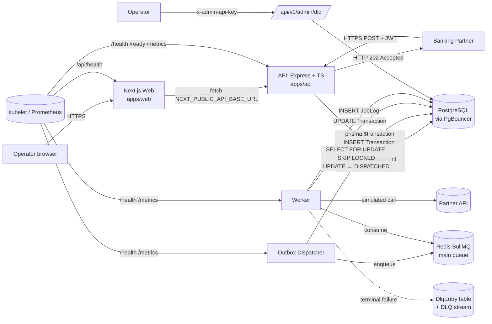
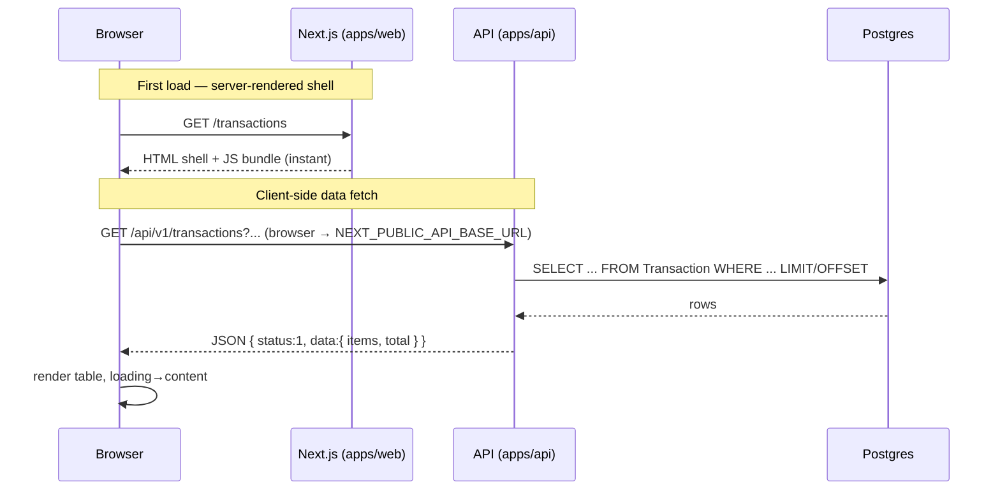
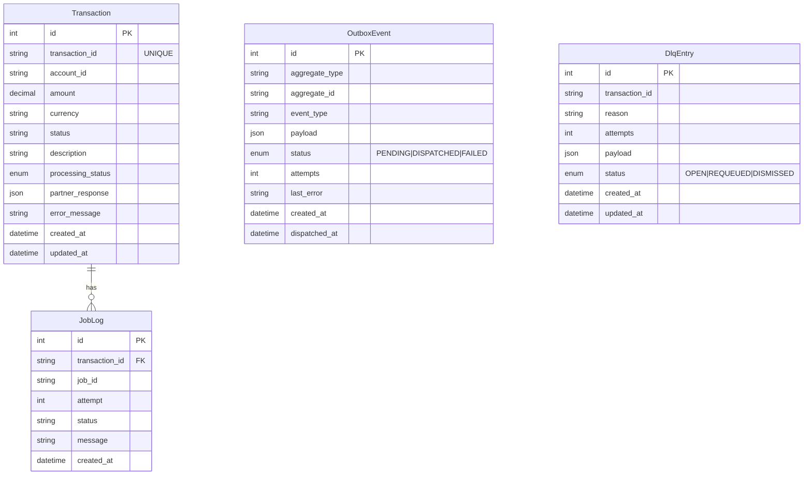
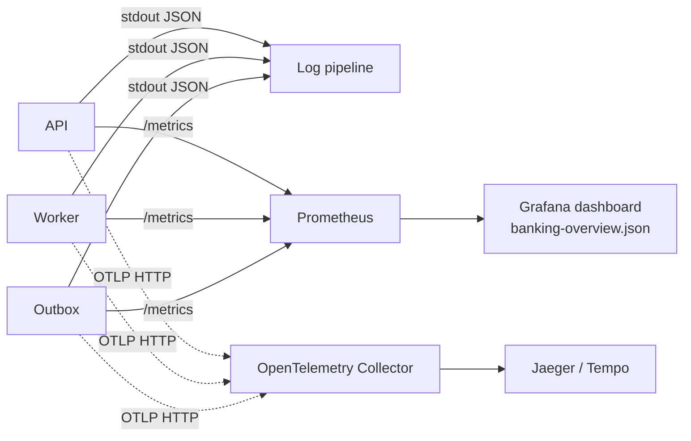
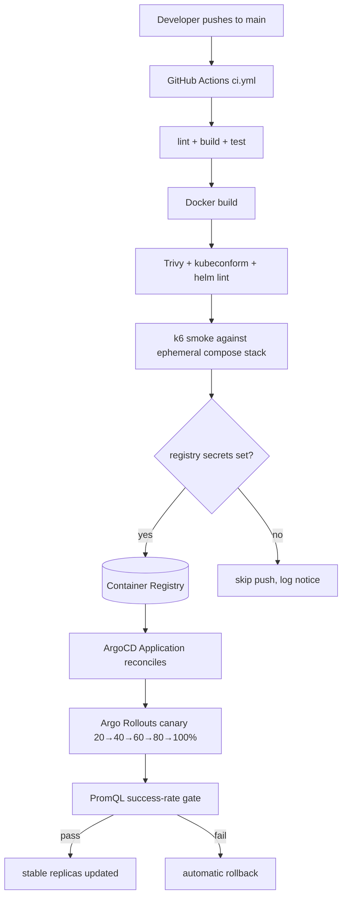

# Architecture

## 1. Overview

`banking-devops-platform` is a **full-stack** system (v2.0): a three-process backend plus a Next.js operations dashboard.

The backend decouples partner-facing acknowledgement from the slow, failure-prone partner-side work using the **outbox pattern**. The API persists and acknowledges in milliseconds without ever touching Redis. A separate **outbox dispatcher** drains pending events into BullMQ. A separate **worker** processes jobs with retries and a DLQ.

All three backend processes share a single Docker image (`apps/api/Dockerfile`), are started with different commands, and communicate only through Postgres (durable state) and Redis/BullMQ (queues).

The **operations dashboard** (`apps/web/Dockerfile`, Next.js App Router) is a thin client. It is operator-facing — not a customer banking UI. The browser fetches from the API at `NEXT_PUBLIC_API_BASE_URL`; the web container does no business logic.

## 2. High-level diagram



## 2b. Frontend request flow



Key points:

- The Next.js app is a thin client. Pages are client components (`'use client'`) that fetch via `apps/web/lib/api.ts`.
- The `NEXT_PUBLIC_API_BASE_URL` is **the URL the browser uses** — not the in-cluster URL. In docker-compose this is `http://localhost:3000`; in Kubernetes it is the public Ingress hostname.
- The web container itself never calls the API in this design (no SSR data fetching). This keeps the trust boundary simple: the dashboard ships HTML + a public JS bundle and that's it.
- Errors surface as a clean message + a copyable `request_id`; the raw API error body is logged in the browser console only.

## 3. Request flow — POST /api/v1/transactions/notify

```mermaid
sequenceDiagram
    participant P as Partner
    participant A as API
    participant DB as PostgreSQL
    participant O as Outbox Dispatcher
    participant Q as Redis (BullMQ)
    participant W as Worker

    P->>A: POST /transactions/notify (Bearer JWT)
    A->>A: verify JWT (HS256, iss/aud)
    A->>A: validate payload (Zod)
    A->>DB: BEGIN; INSERT Transaction (PENDING); INSERT OutboxEvent (PENDING); COMMIT
    A-->>P: 202 Accepted (no Redis touch)
    Note right of A: API responds <200ms p95

    O->>DB: SELECT FOR UPDATE SKIP LOCKED → claim PENDING
    O->>DB: UPDATE OutboxEvent → DISPATCHED
    O->>Q: enqueue process-transaction job
    Q-->>W: deliver job (attempt 1)
    W->>DB: UPDATE Transaction (PROCESSING)
    W->>+PartnerAPI: simulated call
    PartnerAPI-->>-W: success or transient failure
    alt success
      W->>DB: UPDATE Transaction (SUCCESS) + partner_response
      W->>DB: INSERT JobLog (SUCCESS)
    else failure (will retry)
      W->>DB: INSERT JobLog (RETRY)
      Note over Q,W: BullMQ schedules retry with<br/>exponential backoff (5s, 10s, 20s)
      Q-->>W: deliver job (attempt 2..N)
    else retries exhausted
      W->>DB: UPDATE Transaction (FAILED) + error_message
      W->>DB: INSERT JobLog (FAILED) + INSERT DlqEntry (OPEN)
      W->>Q: push to transaction-notification-dlq
    end
```

## 4. Why outbox?

Without the outbox, the API does two writes that are not atomic:

1. INSERT Transaction (Postgres)
2. enqueue BullMQ job (Redis)

If (2) fails, we have a transaction that exists but will never be processed. If (1) succeeds and the API crashes before (2), same problem.

With the outbox, both writes go through a single Postgres transaction. The dispatcher runs separately and is idempotent — re-delivering a job is safe because BullMQ uses `jobId: tx:<transaction_id>:<timestamp>` and downstream state transitions are idempotent.

`SELECT FOR UPDATE SKIP LOCKED` lets multiple dispatcher replicas run in parallel without conflict, so we can scale the dispatcher horizontally.

## 5. Queue flow

```mermaid
flowchart LR
    O[Outbox dispatcher] -->|add('process-transaction')| Wait[(wait queue)]
    Wait --> Active[(active)]
    Active -->|success| Completed[(completed: ttl 1h)]
    Active -->|failure| Delayed[(delayed: backoff 5s/10s/20s)]
    Delayed --> Wait
    Active -->|retries exhausted| Failed[(failed: ttl 24h)]
    Active -.->|terminal failure| DlqStream[(DLQ stream)]
    DlqStream --> DlqTable[(DlqEntry table)]
    Operator -->|requeue| Wait
```

- Main queue: `transaction-notification-queue`. `attempts: 3`, exponential backoff `delay: 5000ms`.
- DLQ stream: `transaction-notification-dlq`. Single attempt; long-lived.
- DlqEntry table: durable record for the admin endpoints.

## 6. Data model



## 7. Layers

```text
HTTP request
   │
   ▼
routes/  ── declarative route mounting (transaction, health, admin)
   │
   ▼
middlewares/  ── auth (JWT / admin-key), rate limit, requestId, logger, metrics
   │
   ▼
controllers/  ── parse + validate, no business logic
   │
   ▼
services/  ── business logic, orchestrate repositories + queue + DLQ
   │
   ▼
repositories/  ── only place that imports PrismaClient
   │
   ▼
PostgreSQL ← PgBouncer
```

The worker and outbox dispatcher bypass routes/controllers/middlewares; they call services/repositories directly.

## 8. Observability



Logs and traces share `request_id` (or trace ID when OTEL is on), so an operator can pivot from a Grafana panel to logs to traces in any direction.

## 9. Deployment flow



## 10. Failure modes & how the system reacts

| Failure                     | Effect                                                                | Mitigation                                                        |
| --------------------------- | --------------------------------------------------------------------- | ----------------------------------------------------------------- |
| Partner API transient error | Job fails, BullMQ retries with backoff                                | `attempts=3`, exponential backoff                                 |
| Partner API hard down       | All retries fail, transaction → `FAILED` + DlqEntry + DLQ stream      | Operator inspects via admin endpoint and `requeue` after recovery |
| Postgres down               | API: 503 from `/ready`; worker + outbox: throw, retried               | Liveness keeps pods up; readiness drains traffic                  |
| Redis down                  | Outbox can't enqueue → events stay PENDING; worker can't fetch jobs    | API keeps accepting (no Redis dep); 503 on `/ready`               |
| API crash mid-write         | Postgres rolls back; partner sees 5xx and retries                     | `prisma.$transaction` is atomic                                   |
| Outbox dispatcher crash     | Pending events resume on restart                                      | `SKIP LOCKED` lets a second replica continue immediately          |
| Worker pod crash            | In-flight jobs returned to wait state                                 | `replicas≥1`, BullMQ visibility timeout                           |
| Schema migration failure    | API container exits, Deployment surfaces failure                      | `prisma migrate deploy` runs on startup; failures block rollout   |
| Bad release                 | Argo Rollouts AnalysisTemplate fails success-rate; rollback automatic | Canary steps pause for analysis between each weight bump          |

## 11. Production hardening (still open — see PRD §20)

- **mTLS** at the Ingress (signed JWT is shipped; mTLS is the next layer).
- **Retry classification** (4xx permanent vs 5xx transient) in the worker.
- **KEDA** queue-depth autoscaling for worker and outbox dispatcher.
- **Multi-region active-active** with read replicas and a global queue.
